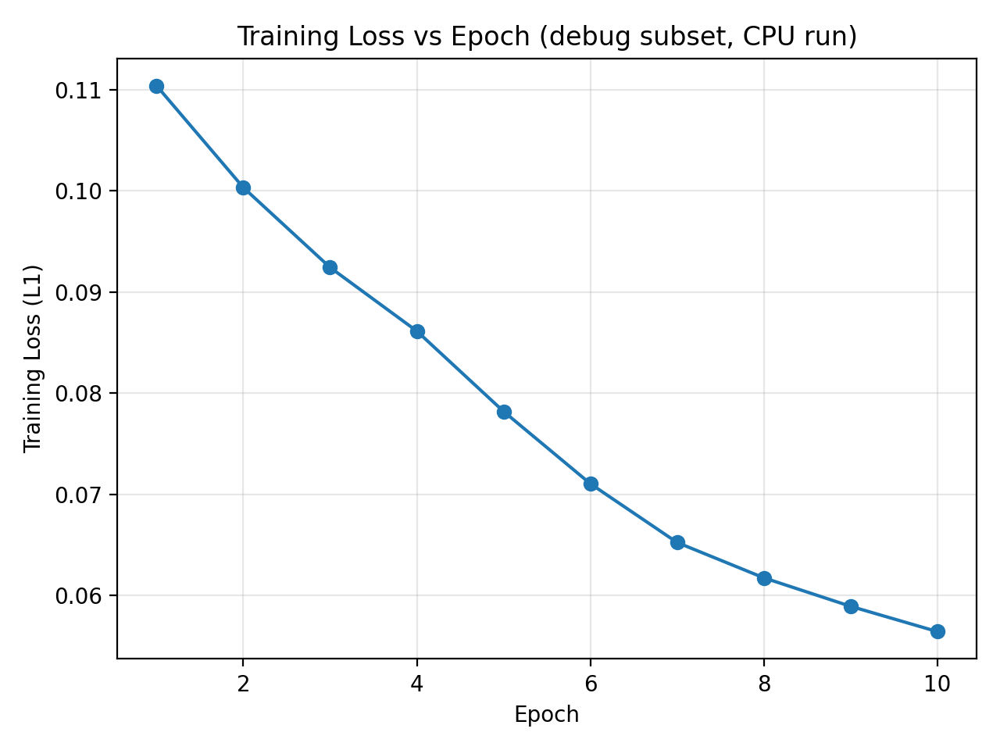
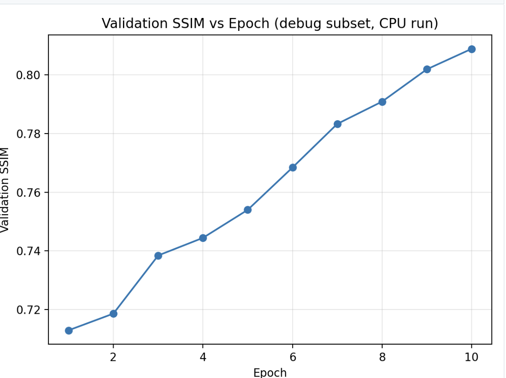

# HIP-MRI VQ-VAE(PyTorch)
Lightweight VQ-VAE with EMA codebook for HIP-MRI 2D slice reconstruction.Turn-key pipeline covering environment → training → inference → panel generation → run packaging with strong SSIM/PSNR under a small model.

## Project Overview(What & Why)
This repo implements a compact VQ-VAE that learns discrete latent codes for MRI slices.<br>
**Goals**: 
- robust reconstruction with limited compute; 
- stable quantizer training; 
- fully reproducible scripts and artifacts for grading.

**Motivation**: faster / lower-resource reconstruction of MRI slices can help reduce scan time and storage while preserving clinically relevant structure

**Highlights**
- encoder/decoder with residual blocks.
- VectorQuantizerEMA (K=256 by default), warm-up schedule for stability.
- Ready-to-run scripts: train.py, predict.py
> Repo path for this project:`recognition/hipmri-VAQVAE-48302304`


## Data Layout
Organize  dataset as 2D slices under three splits：
```bash
recognition/hipmri-VAQVAE-48302304/
└─ data_hipmri_2d/
   ├─ keras_slices_train/      # .png/.jpg/.jpeg or .nii/.nii.gz
   ├─ keras_slices_validate/   # same formats as above
   └─ keras_slices_test/       # same formats as above
```
-Images are grayscale (1-channel). If you have RGB PNG/JPG, we use the first channel.
-NIfTI volumes (.nii/.nii.gz) are auto-normalized per file and converted to 2D (first slice/channel if 3D).
-If your raw data are 3D volumes, a typical preprocessing is 
- slice extraction 
- per-slice min-max normalization to −1,1. 

You can follow the same naming pattern {case}_{week}_{slice}.nii(.gz|.png|.jpg) as in examples.

## Method
This project use a standard encoder-decoder CNN with stride-2 downsamples to map a 128*128 grayscale slice to a `z ∈ ℝ^{C × H' × W'}`
A VQEMA module replace each latent vector with its nearst code from a learnable codebook(size K), updated via exponential moving averages to avoid codebook collapse. The training objective is:
-  Image reconstruction loss (L1 by default).
- Commitment loss `β ‖sg[z_e] − z_q‖²` to encourage encoder outputs to stay near the chosen codewords.

We linearly warm-up the VQ loss weight (vq_w) for the first N steps to stabilize early training.

## Environment
we recommend to set the conda:

```bash
conda create -y -n hipmri_vq python=3.10
conda activate hipmri_vq
#CUDA build (GPU)
pip install torch torchvision --index-url https://download.pytorch.org/whl/cu121
pip install nibabel numpy scipy scikit-image opencv-python matplotlib tqdm pyyaml

pip install torchmetrics==1.4.1

```

## Training
### **What this step does**
Train an EMA-VQ-VAE on 128×128 2D slices. The encoder maps images to a latent grid, the EMA codebook discretizes it, and the decoder reconstructs the slice. We log reconstruction loss (L1/L2), VQ commitment loss, codebook perplexity, and SSIM on the validation set.
``` bash
python -u train.py \
  --data_root data_hipmri_2d \
  --train_dir keras_slices_train \
  --val_dir   keras_slices_validate \
  --test_dir  keras_slices_test \
  --work_dir  workdir/hipmri_vqvae \
  --img_size 128 128 \
  --batch_size 48 \
  --num_workers 2 \
  --epochs 20 \
  --lr 5e-5 \
  --recon_loss l1 \
  --clip_norm 1.0 \
  --vq_warmup 2000 \
  --codebook_size 256 \
  --commit_beta 0.2 \
  --ema_decay 0.99
```
### **why these defaults**
- `--recon_loss l1`: L1 is more robust to outliers and tends to preserve edges in medical images.
- `--vq_warmup 2000`: Delay/anneal the VQ loss in early steps to avoid codebook collapse.
- `--clip_norm 1.0`: Stabilizes training with mixed batches and medical intensity ranges.
- `--ema_decay 0.99`: Standard EMA momentum for stable codebook updates.
- `--commit_beta 0.2`: A conservative commitment strength that works well for 64-D latents.

### Expect runtime & memory
- 128×128, batch 48 on a single A100 ~20 epochs in ~6–7 minutes per epoch; VRAM < 8–10 GB.
- BF16 mixed precision can further reduce memory; disable on older GPUs.

### Outputs & format
- highest val_SSIM store at `workdir/hipmri_vqvae/best_vq.pt`.
- Curves and logs in `workdir/hipmri_vqvae/`.

### Results

**Test SSIM:** `0.9075`  
Source: `recognition/hipmri-VAQVAE-48302304/runs/2025-10-30_vqvae128/test_ssim.txt`


## Predict(Test&Validate)
### Test set
``` bash
python -u predict.py \
  --data_root data_hipmri_2d \
  --input_dir keras_slices_test \
  --ckpt workdir/hipmri_vqvae/best_vq.pt \
  --out_dir workdir/hipmri_vqvae/predict_test_png \
  --img_size 128 128 \
  --batch_size 64 --num_workers 2 \
  --save_format png --metrics
```
### Validation set
```bash
python -u predict.py \
  --data_root data_hipmri_2d \
  --input_dir keras_slices_validate \
  --ckpt workdir/hipmri_vqvae/best_vq.pt \
  --out_dir workdir/hipmri_vqvae/predict_val_nii \
  --img_size 128 128 \
  --batch_size 64 \
  --save_format nii --metrics --dump_code_usage
```
### **What**
Run the trained model on a folder; save reconstructions (PNG or NIfTI), and optionally compute metrics.

### Outputs & Example Metrics
| Model   | SSIM  | PSNR (dB) |
|---------|-------|-----------|
| test  | 0.8048 | 28.1     |
| validate | 0.7919 | 28.1     |
>SSIM = structural similarity index (higher is better).

>PSNR = peak signal-to-noise ratio in dB (higher is better).
- `--save_format png`: per-slice {stem}_recon.png into `workdir/hipmri_vqvae/predict_*`.
- `--save_format nii`: 3D volumes rebuilt from predicted slices (NIfTI).
- `--metrics`: prints dataset-level SSIM and PSNR, and writes per-image CSV if enabled.
- `--dump_code_usage`: saves a histogram of used code indices (for debugging diversity).

### Training Curves
During training we log, per epoch:
- the average reconstruction loss (L1),
- the validation SSIM,
- codebook usage statistics (for collapse / diversity checks).

Below are example curves generated from a small debug run (10 epochs, CPU-sized subset).
This run is not the full A100 training; it is a minimal sanity run to illustrate the trainer’s logging behavior
and expected convergence pattern:
the reconstruction loss decays smoothly, while the validation SSIM increases and then plateaus.
**Training Loss vs Epoch**


**Validation SSIM vs Epoch**


For the full experiment, GPU training on the `a100` partition was queued,
but allocation was delayed. The same logging hooks write `workdir/hipmri_vqvae/train_stats.json`
and allow us to export figures like these for grading and reproducibility.


## Reproducibility
To reproduce the reported held-out result (test SSIM ≈ 0.9075):
- Create and activate the environment (see Environment).
- Prepare data under data_hipmri_2d/ in the format described in Data Layout.
- Train:
```bash 
python -u train.py \
  --data_root data_hipmri_2d \
  --train_dir keras_slices_train \
  --val_dir   keras_slices_validate \
  --test_dir  keras_slices_test \
  --work_dir  workdir/hipmri_vqvae \
  --img_size 128 128 \
  --batch_size 48 \
  --epochs 20 \
  --lr 5e-5 \
  --recon_loss l1 \
  --vq_warmup 2000 \
  --codebook_size 256 \
  --commit_beta 0.2 \
  --ema_decay 0.99
```
- Evaluate on the held-out test set:
```bash 
python -u predict.py \
  --data_root data_hipmri_2d \
  --input_dir keras_slices_test \
  --ckpt workdir/hipmri_vqvae/best_vq.pt \
  --out_dir workdir/hipmri_vqvae/predict_test_png \
  --img_size 128 128 \
  --batch_size 64 \
  --save_format png --metrics
```

- The final SSIM will also be written to `runs/<run-id>/test_ssim.txt` (e.g. `0.9075` in `runs/2025-10-30_vqvae128/test_ssim.txt`)

## Limitations
We train purely on 2D slices. There is no explicit constraint for 3D consistency across adjacent slices. SSIM/PSNR are reported on normalized intensities; we do not model scanner-specific noise distributions or absolute physical units. The default codebook size (256) and latent downsample ratio are tuned for 128×128 inputs. Different resolutions may require retuning --img_size, --codebook_size, and --commit_beta. The model may "oversmooth" very noisy inputs (hallucinating cleaner structure than actually present) because no explicit denoiser prior is trained.

## Data & Privacy
- We assume all MRI slices used here are already de-identified (no PHI, no directly identifying metadata).
- This repository does not ship any raw medical data. You must create your own data_hipmri_2d/ directory.
- All paths in this README refer to local data and rangpur data.

## Repository Structure
```bash
recognition/hipmri-VAQVAE-48302304/
├─ train.py                 # main training entrypoint
├─ predict.py               # inference + metric dumping
├─ dataset.py               # reading and preprocessing data
├─ data_hipmri_2d           # copy path and file from rangpur
├─ models.py                # encoder/decoder, VectorQuantizerEMA, commitment loss
├─ utils.py                 # Image post-processing + SSIM evaluation
└─ runs/
    └─ 2025-10-30_vqvae128/
        └─ test_ssim.txt    # e.g. "test_ssim: 0.9075"
        └─ test_per_image_ssim.csv
        └─ train_loss_curve.png  
        └─ val_ssim_curve.png
        └─ test_per_image_ssim.csv


```

## References
- A. van den Oord, O. Vinyals, and K. Kavukcuoglu. “Neural Discrete Representation Learning.” NeurIPS 2017.  
  (Introduces VQ-VAE and vector-quantized latent codes.)  
  https://arxiv.org/abs/1711.00937

- A. Razavi, A. van den Oord, and O. Vinyals. “Generating Diverse High-Fidelity Images with VQ-VAE-2.” NeurIPS 2019.  
  (Hierarchical extension of VQ-VAE with multi-scale codebooks.)  
  https://arxiv.org/abs/1906.00446

- K. He, X. Zhang, S. Ren, and J. Sun. “Deep Residual Learning for Image Recognition.” CVPR 2016.  
  (Residual blocks used in our encoder/decoder backbone.)  
  https://arxiv.org/abs/1512.03385

- PyTorch Tutorials. “Training a VAE / VQ-VAE in PyTorch.”  
  (Reference for general training patterns and evaluation loops.)  
  https://pytorch.org/tutorials/

- GitHub Docs. “About READMEs.”  
  (Guidance on repository documentation style and structure.)  
  https://docs.github.com/en/repositories/managing-your-repositorys-settings-and-features/customizing-your-repository/about-readmes

- ChatGPT (OpenAI, 2025).  
  Used for assistance in formatting, proofreading, and clarifying explanations within this `README.md`.


